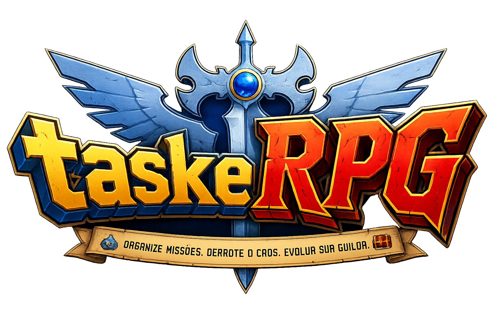

> Transforme trabalho em aventura.
>
> Um gerenciador de tarefas baseado em Kanban que combina produtividade, colaboração e gamificação inspirada em RPGs, guildas e jogos de cartas.

---

## O Problema

A maioria das ferramentas de gestão mede apenas:

- quantidade de tarefas entregues;
- velocidade;
- throughput.

Mas equipes de alta performance não vivem apenas disso.

Elas dependem de:

- colaboração;
- redução de riscos;
- qualidade;
- refinamento;
- previsibilidade;
- remoção de bloqueios;
- trabalho em equipe.

O Task Manager RPG foi criado para tornar esses comportamentos visíveis e recompensados.

---

## O Conceito

Cada tarefa é uma criatura.

Cada épico é um Boss.

Cada colaborador é um Herói.

Cada squad é uma Guilda.

O trabalho diário continua sendo um Kanban tradicional, mas por trás dele existe uma camada de progressão, recompensas e métricas que transforma a execução do projeto em uma experiência coletiva.

---

## Filosofia

O objetivo não é criar competição.

O objetivo é incentivar:

✅ colaboração

✅ redução de incerteza

✅ qualidade

✅ compartilhamento de conhecimento

✅ planejamento eficiente

✅ remoção de bloqueios

✅ entrega sustentável

---

# Como Funciona

## Heróis

Representam os executores do trabalho.

Exemplos:

- Backend
- Frontend
- QA
- Design

Os heróis evoluem através de:

- desenvolvimento
- revisões
- colaboração
- correção de bugs
- ajuda a colegas
- remoção de bloqueios

### Hero XP

Experiência obtida pela execução eficiente do trabalho.

---

## Guild Masters

Representam as pessoas responsáveis por estratégia e coordenação.

Exemplos:

- Product Owner
- Product Manager
- Analistas
- Tech Leads

### Strategy XP

Experiência obtida por:

- refinamentos bem feitos
- redução de escopo
- remoção antecipada de bloqueios
- melhoria de previsibilidade
- redução de retrabalho
- quebra eficiente de épicos

---

# Mecânicas

## Pureza da Quest

Toda tarefa nasce com:

```text
Pureza = 100%
```

Eventos que reduzem a pureza:

- retorno do QA
- mudança de requisito
- bugs em produção
- retrabalho

A Pureza influencia a recompensa final.

Quanto mais limpa a jornada da tarefa, maior o XP obtido.

---

## Retrabalho HP

Quando algo retorna para desenvolvimento, o monstro ganha vida novamente.

```text
Task HP +10
```

O sistema rastreia a origem do retrabalho:

- Produto
- Engenharia
- Dependências externas

Isso permite visualizar desperdícios reais do processo.

---

## XP de QA

QA não existe para punir.

QA existe para proteger a guilda.

O sistema recompensa:

- identificação de problemas
- prevenção de falhas
- detecção de riscos
- cobertura de testes

Quanto mais cedo um problema é encontrado, maior a recompensa.

---

## Reduction XP

Produto recebe recompensas por:

- simplificar soluções
- reduzir complexidade
- antecipar riscos
- melhorar estimativas
- remover incertezas

O foco deixa de ser apenas criar tarefas.

O foco passa a ser tornar o trabalho mais eficiente.

---

## Party Combo

Quando uma tarefa percorre o fluxo sem retornos:

```text
PO
 ↓
Design
 ↓
Backend
 ↓
Frontend
 ↓
QA
 ↓
Produção
```

Toda a party recebe bônus.

Quanto melhor a colaboração, maior o combo.

---

## Bosses de Sprint

Épicos se transformam em chefes.

Toda atividade causa dano:

- Refinamento
- Design
- Desenvolvimento
- QA
- Deploy

O boss é derrotado quando o épico é concluído.

---

# Sistema de Cartas

Existem dois grupos principais de cartas.

## Cartas de Herói

Representam habilidades individuais.

Exemplos:

- Mestre da Refatoração
- Caçador de Bugs
- Revisor Lendário
- Escudo Anti-Retrabalho

---

## Cartas Estratégicas

Utilizadas pelos Guild Masters.

Exemplos:

- Refinamento Perfeito
- Redução de Escopo
- Mitigação de Risco
- Eliminação de Bloqueio

---

# Progressão

## Individual

Cada membro possui:

- Nível
- XP
- Histórico
- Conquistas
- Cartas desbloqueadas

---

## Guilda

A guilda evolui através de:

- entregas bem-sucedidas
- qualidade
- colaboração
- conclusão de bosses
- combos coletivos

---

# Interface

O Kanban continua sendo o elemento principal.

A gamificação complementa a experiência.

```text
┌────────────────────────────────────┐
│ Header                             │
├────────────────────────────────────┤
│ Guild Status    │ Sprint Boss      │
├────────────────────────────────────┤
│                                    │
│           Kanban Board             │
│                                    │
├────────────────────────────────────┤
│ Hero Progress │ Party Activity     │
└────────────────────────────────────┘
```

A produtividade vem primeiro.

O jogo existe para reforçar comportamentos positivos.

---

# Objetivos do Projeto

- Tornar retrabalho visível.
- Incentivar colaboração.
- Melhorar qualidade.
- Recompensar prevenção.
- Valorizar produto e engenharia.
- Criar uma experiência divertida sem prejudicar a produtividade.

---

# Roadmap

## MVP

- [ ] Kanban
- [ ] Sistema de usuários
- [ ] Hero XP
- [ ] Strategy XP
- [ ] Pureza da Quest
- [ ] Party Combo
- [ ] Bosses de Sprint

## Fase 2

- [ ] Sistema de cartas
- [ ] Inventário
- [ ] Conquistas
- [ ] Guild Progress

## Fase 3

- [ ] Eventos sazonais
- [ ] Raids
- [ ] Marketplace de cartas
- [ ] Guild Wars cooperativas

---

## Licença

MIT
